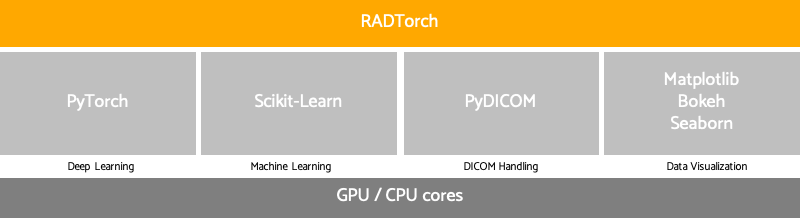

<head>

<!-- Global site tag (gtag.js) - Google Analytics -->

</head>

# RADTorch  <small> The Radiology Machine Learning Framework </small>

<!-- ## About -->

RADTorch provides a framework of higher level classes and functions that aim at significantly reducing the time needed for implementation of different machine and deep learning algorithms on DICOM medical images.

RADTorch was <b>built by radiologists for radiologists</b> so they can build, test and implement state-of-the-art machine learning algorithms in <b>minutes</b>.

RADTorch was developed and is currently maintained by <b>Mohamed Elbanan, MD</b>: a Radiology Resident at Yale New Haven Health System, Clinical Research Affiliate at Yale School of Medicine and a Machine-learning enthusiast.

RADTorch is built upon widely used machine learning and deep learning frameworks. These include:

1. PyTorch for Deep Learning and Neural Networks.

2. Scikit-learn for Data Management and Machine Learning Algorithms.

3. PyDICOM for handling of DICOM data.

4. Bokeh, Matplotlib and Seaborn for Data Visualization.

<!--  -->
