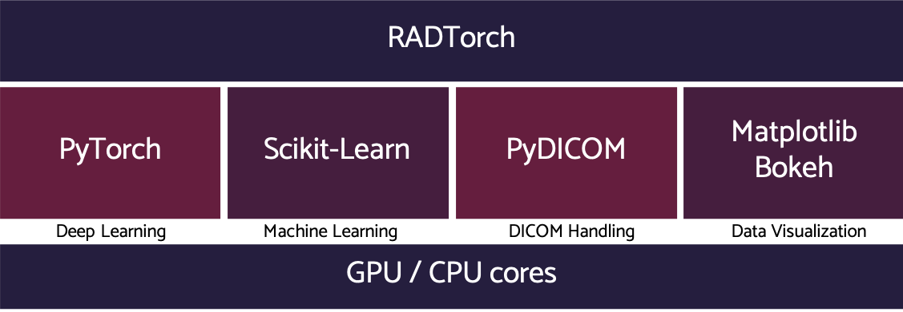

<head>

<!-- Global site tag (gtag.js) - Google Analytics -->
<script async src="https://www.googletagmanager.com/gtag/js?id=UA-116382803-2"></script>
<script>
window.dataLayer = window.dataLayer || [];
function gtag(){dataLayer.push(arguments);}
gtag('js', new Date());
gtag('config', 'UA-116382803-2');
</script>

</head>


# RADTorch  <small> The Radiology Machine Learning Tool Kit </small>

## About
<p style='text-align: justify;'>
RADTorch provides a package of higher level functions and classes that significantly decrease the amount of time needed for implementation of different machine and deep learning algorithms on DICOM medical images.
</p>




<p style='text-align: justify;'>
RADTorch was developed and is currently maintained by Mohamed Elbanan, MD: a Radiology Resident at Yale New Haven Health System, Clinical Research Affiliate at Yale School of Medicine and a Machine-learning enthusiast.
</p>


## Getting Started

Running a state-of-the-art DICOM image classifier can be run using the [Image Classification](pipeline/#image_classification) Pipeline using the commands:
```
from radtorch import pipeline

classifier = pipeline.Image_Classification(data_directory='path to data')
classifier.run()
```
<small>
The above 3 lines of code will run an image classifier using VGG16 with pre-trained weights.
</small>


## Playground


<p></p> RADTorch playground for testing is provided on [Google Colab](https://colab.research.google.com/drive/1O7op_RtuNs12uIs0QVbwoeZdtbyQ4Q9i).


## Feature Requests

Feature requests are more than welcomed on our discussion board [HERE](https://github.com/radtorch/radtorch/issues/4#issue-573590182)


## Contributing
 <p></p>  RadTorch is on [GitHub](https://github.com/radtorch/radtorch). Bug reports and pull requests are welcome.
